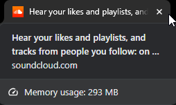

# scrp
A wrapper for Soundcloud that adds Discord Rich Presence support.
[Lightweight](#performance) and fast thanks to the `Tauri` app framework.

## Usage
1. Download the installer from the [releases](https://github.com/dxxxxy/scrp/releases) page.
2. Run the installer.
3. Run `scrp` from the start menu.

## Showcase

## Performance
> Around the same if not lower than the browser tab in terms of memory usage.

## Disclaimer
This is for educational purposes only. I am not responsible for any damage caused by this tool.

## License
GPLv3 © dxxxxy